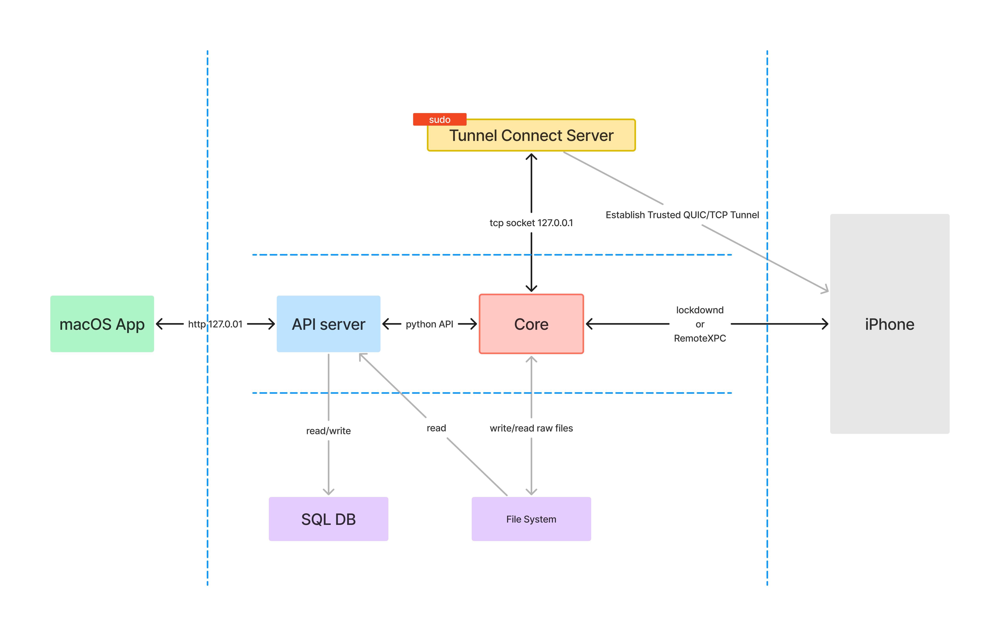

# Automated Performance Testing Suite for Mobile iOS Applications

This repository contains the code related to my Bachelor's Capstone Project *"Automated Performance Testing Suite for
Mobile iOS Applications: Designed for repetitive tests and data collection of performance metrics"*.

## Table of Contents

<!-- TOC -->

* [Automated Performance Testing Suite for Mobile iOS Applications](#automated-performance-testing-suite-for-mobile-ios-applications)
    * [Table of Contents](#table-of-contents)
    * [Introduction](#introduction)
    * [Components](#components)
        * [Repository Structure](#repository-structure)
    * [Usage](#usage)
        * [Prerequisites](#prerequisites)
        * [Clone the repository](#clone-the-repository)
        * [Install and Run the servers](#install-and-run-the-servers)
        * [Install and Run the macOS App](#install-and-run-the-macos-app)
    * [Development](#development)
    * [Contact](#contact)

<!-- TOC -->

## Introduction

This project was designed to execute repeated and controlled performance tests on mobile iOS applications using Xcode' [XCUITests](https://developer.apple.com/documentation/xctest/user-interface-tests) for tests and [Instruments](https://developer.apple.com/tutorials/instruments/) app for metric collection. To achieve this, the project uses various Xcode Command Line Tools (e.g. `xcodebuild`) and [`pymobiledevice3`](https://github.com/doronz88/pymobiledevice3/tree/master) to interact with physical iOS devices. For a more detailed overview of these technologies please refer to the cores' README [Technologies](core/README.md#main-technologies) section.

On a high level, the project aims to provide the following features:

- ✅ Device selection and connection to physical iOS devices.
- ✅ Build an application from source code.
- ✅ Configure test plans that define the tests executed and the metrics collected.
- ✅ Execute test plan on a physical iOS device using the test plan configuration and build.
- ✅ Export and parse the collected metrics.
- 🚧 Package server with macOS app for easy use.

While these are a high level description of features, please take a look at each component to get a more detailed overview of the features and technologies used.

## Components

The project is divided into three main components:

| Component | Description                                                             | README                    |
|-----------|-------------------------------------------------------------------------|---------------------------|
| Core      | A Python library that provides the main functionality of the project.   | [README](core/README.md)  |
| API       | A FastAPI server that provides a RESTful API to interact with the Core. | [README](api/README.md)   |
| macOS     | A SwiftUI macOS app that provides a graphical user interface.           | [README](macOS/README.md) |

The following diagram shows a basic overview of the interaction between the components, the real device, database, and file system.



### Repository Structure

```
/root
|-- core/                   # Core library
|-- api/                    # API Server
|-- macOS/                  # SwiftUI macOS app
|-- misc/                   # Miscellaneous files (example iOS xcode project and server installation script)
|-- README.md               # This file
```

## Usage

### Prerequisites

| Technology | Version | Description                                                                                                                    |
|------------|---------|--------------------------------------------------------------------------------------------------------------------------------|
| Python     | 3.13+   | Api and Core were developed developed using Python 3.13.                                                                       |
| Xcode      | 16+     | Xcode for xcode specific operations.                                                                                           |
| macOS      | 14+     | macOS is required for this to run as the Core interacts with xcode tools. The minimum version of `14` is set by the macOS app. |

### Clone the repository

```bash
   git clone git@github.com:marvin-kolja/capstone.git
   cd capstone
```

### Install and Run the servers

1. Run the installation script

This will install python dependencies and sets up server environment in `~/capstone`.

> [!CAUTION]
> This requires `python3.13` to be installed and available in the PATH. Check if `python3.13` is available by running `command -v python3.13`.

[//]: # (> [!CAUTION])

[//]: # (> As the project isn't publicly available on GitHub the following command requires a URL with a token.)

[//]: # (> Please go to https://github.com/marvin-kolja/capstone/tree/main/misc/install_server.sh and get the RAW URL and replace the URL in the following command.)

[//]: # ()

[//]: # (```bash)

[//]: # (curl -sSL "https://raw.githubusercontent.com/marvin-kolja/capstone/refs/heads/main/misc/install_server.sh" | bash)

[//]: # (```)

```bash
sh ./misc/install_server.sh
```

2. Start the server

```bash
sh ~/capstone/start_server.sh
```

3. Start the tunnel connect server

> [!NOTE]
> This will ask for your password to start the tunnel connect server. Please read more about why this is necessary in the [core README](core/README.md#ios-trusted-tunnel).

```bash
sh ~/capstone/start_tunnel_server.sh
```

4. Make sure it's working

```bash
curl http://localhost:8000/health
# {"status":"ok","db":"ok","tunnel_connect":"ok"}
```

### Install and Run the macOS App

> [!IMPORTANT]
> Currently, the macOS is not distributed to GitHub. You can either [build it](macOS/README.md#distribution) yourself or [contact](#contact) me for a pre-built signed and notarized version.

## Development

1. Clone the repository:
   ```sh
   git clone git@github.com:marvin-kolja/capstone.git
   cd capstone
   ```

2. Follow the setup instructions in each component's README.
    - [macOS README](macOS/README.md)
    - [API README](api/README.md)
    - [Core README](core/README.md)

3. Start the API and the macOS app as instructed in their respective READMEs.

## Contact

Marvin Kolja Willms - [marvin.willms@code.berlin](mailto:marvin.willms@code.berlin)
