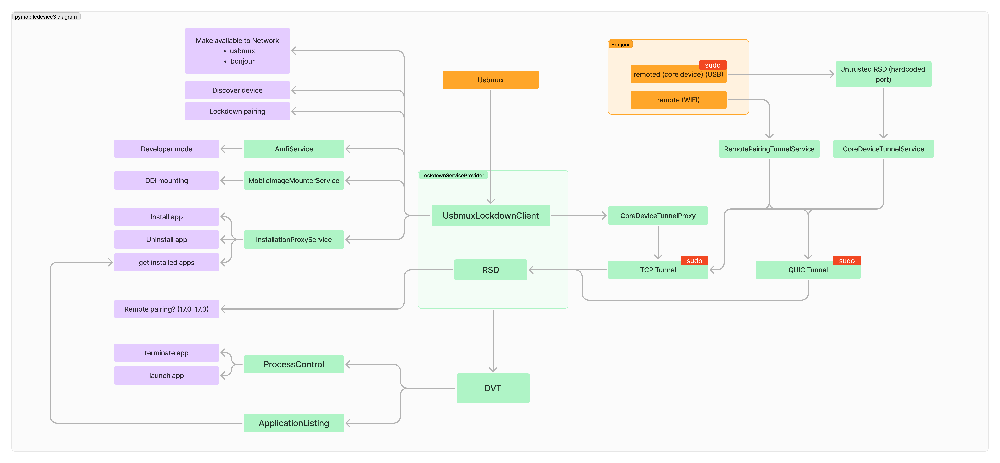

# Core

A Python library that provides the main functionality of the project. It implements all crucial operations such as device discovery, test execution, metric collection, etc. By design, this was implemented as a standalone library allowing direct interaction with the Core without the need for the API or macOS app. This is useful for implementing this into a CI/CD pipeline or other automation tools.

The Core only retains raw files generated by the tools it uses. For example, `xctrace` results are stored in `.trace` files/packages (raw data). Exporting metrics from them will generate `.xml` files (raw data). However, the parsed data from those files is not stored anywhere, requiring the user/developer to handle persistent references to raw files.

## Table of Contents

<!-- TOC -->

* [Core](#core)
    * [Table of Contents](#table-of-contents)
    * [Main Technologies](#main-technologies)
    * [Features](#features)
    * [Structure](#structure)
    * [Development](#development)
        * [Prerequisites](#prerequisites)
        * [Setup](#setup)
        * [Tests & Coverage](#tests--coverage)
            * [Run tests](#run-tests)
            * [Pytest Markers](#pytest-markers)
            * [Coverage](#coverage)
        * [Formatting](#formatting)
        * [Logging](#logging)
        * [Xcresult code generation](#xcresult-code-generation)
        * [iOS Trusted Tunnel](#ios-trusted-tunnel)
            * [Elevated Privileges Requirement](#elevated-privileges-requirement)
    * [How `pymobiledevice3` is used.](#how-pymobiledevice3-is-used)
    * [Contact](#contact)

<!-- TOC -->

## Main Technologies

The Core uses various technologies to interact with physical iOS devices, execute tests and collect metrics. The following is a list of the main technologies used:

| Technology                                                                                        | Description                                                       |
|---------------------------------------------------------------------------------------------------|-------------------------------------------------------------------|
| [`xcodebuild`](https://developer.apple.com/documentation/xcode/user_interface/command-line_tools) | Command line tool used to build and execute tests Xcode projects. |
| [`xctrace`](https://developer.apple.com/documentation/xcode/running-performance-tests)            | Command line tool used to collect and export performance metrics. |
| [`xcrun xcresulttool`](https://keith.github.io/xcode-man-pages/xcresulttool.1.html)               | Command line tool used to exatract data from `.xcresult` files.   |
| [`pymobiledevice3`](https://github.com/doronz88/pymobiledevice3)                                  | Python library used to interact with physical iOS devices.        |

## Features

- ✅ Device discovery, connection, paring, mounting DDI, enable developer mode, and trusted tunnel creation.
    - ✅ Install, uninstall, and list applications on device.
    - ✅ Launch, terminate, and get application pid on device (requires trusted tunnel).
- ✅ Parse an `.xcodeproj` file to extract Xcode project information.
- ✅ Build iOS application from Xcode project source code.
- ✅ Get test cases from a built iOS application.
- ✅ Execute test cases on a physical iOS device using the built application.
- ✅ Collect performance metrics using `xctrace`, export and parse them.
    - ✅ CPU usage
    - ✅ Memory
    - ✅ FPS
    - ✅ GPU usage
    - 🚧 Network
    - 🚧 Disk usage
- ✅ Parse `xcodebuild` `xcresult` files (specifically test results).
- ✅ Create test plans that allow the user to define test steps.
    - ✅ What tests to execute.
    - ✅ What metrics to collect.
    - ✅ Repetition of test steps and whole test plan.
    - ✅ Take a look for all configurations here: [core/test_session/plan](core/test_session/plan.py).
- ✅ Test Session executing the test plan

## Structure

```
/core
|-- /core
|   |-- codec               # JSON codecs for socket communication.
|   |-- common/             # Common utility functions.
|   |-- device/             # Device interactions (e.g. discover, connect, pair, etc.)
|   |-- exceptions/         # Custom exceptions.
|   |-- test_session/       # Test session management (e.g. test plan, test execution, etc.)
|   |-- tunnel/             # Client and server for tunnel creation to physical iOS devices (uses async_socket). 
|   |-- xc/                 # xcode related operations (e.g. build, trace, etc.)
|   |-- async_socket.py     # Asynchronous socket client and server using JSON codecs to communicate.
|   |-- hasher.py           # Hashing utility functions for integrity.
|   |-- subprocess.py       # Wrapper for subprocess operations used to execute commands such as `xcodebuild`.
|
|-- /scripts/               # Scripts to execute tests and generate xcresult models.
|
|-- /tests/                 # Tests for the core library (pytest).
```

## Development

### Prerequisites

| Technology | Version | Description                                   |
|------------|---------|-----------------------------------------------|
| Poetry     | 1.8     | Dependency management.                        |
| Python     | 3.13+   | Core library was developed using Python 3.13. |
| Xcode      | 16+     | Xcode for xcode specific operations.          |

> [!NOTE]
> The core library might work with lower versions of Python and Xcode. I have not tested it, thus, I cannot guarantee that it will work as expected. Feel free to test with lower versions and let me know if it works.

### Setup

1. Creat environment:
   ```sh
   poetry env use python3.13
   ```

2. Activate environment:
   ```sh
    poetry shell
    ```

3. Install dependencies:
    ```sh
    poetry install
    ```

### Tests & Coverage

The core library uses `pytest` for testing and `coverage` for code coverage. Running tests will also generate a coverage report:

#### Run tests

```sh
sh scripts/test.sh
```

**Options:**

- `--device` - Additionally run tests that interact with a physical iOS device.
- `--integration` - Run integration tests.
- `--unit` - Run unit tests.
- `--verbose` - Verbose logging during test execution.

**Tunnel Connection:**

To test parts of code that require a tunnel connection to a physical iOS device, you can execute tests using sudo:

```sh
sudo sh scripts/test.sh --device
```

> [!IMPORTANT]
> Read more about why this is necessary in the [iOS Trusted Tunnel](#ios-trusted-tunnel) section.

#### Pytest Markers

In order to specify a test to require sudo or a connected device you can use the following markers:

> [!NOTE]
> These test are skipped if tests are executed without the requirements specified in the markers.

```python
@pytest.mark.real_device
def test_something_that_requires_a_device():
    pass


@pytest.mark.requires_sudo
def test_something_that_requires_sudo():
    pass
```

#### Coverage

To generate a coverage report, run the following command:

```sh
coverage report -m
```

### Formatting

The core library uses `black` for code formatting. Simply run the following command to format the code:

```sh
black core
```

### Logging

The core library uses the `logging` module for logging.

To log messages, use the following code snippet:

```python
import logging

logger = logging.getLogger(__name__)

logger.debug("Debug message")
```

### Xcresult code generation

The core parses xcresult files to generate Python models. To extract `xcresult` schemas, we can leverage the `xcrun xcresulttool` command line tool. The following command will print the JSON schema for the test `summary`:

```sh
xcrun xcresulttool get test-results summary --help
```

Place the JSON schema inside `scripts/xcresult_model_generator/schemas/test_results/summary.json` and run the following command to generate the Python model:

```sh
sh scripts/generate_models.sh
```

### iOS Trusted Tunnel

Since iOS 17.0 Apple has changed the way we can interact with developer services. It now requires a trusted tunnel to be established before we can interact with developer services. This is a lot more complicated and I recommend checking out the `pymobiledevice3`[ idevice protocol layers](https://github.com/doronz88/pymobiledevice3/blob/master/misc/understanding_idevice_protocol_layers.md#remotexpc) documentation for more information.

#### Elevated Privileges Requirement

Creating such trusted tunnels requires elevated privileges. This is why some tests require `sudo` to run.

As we do not want to execute the entire code with `sudo`, a tunnel connect server was written to handle the tunnel connections. That server can be started independently and will handle the tunnel connections for the core library. This way, we can run the core library without `sudo` and still interact with physical iOS devices. The server uses the `async_socket` module to allow asynchronous communication with the core library (which uses a socket client).

To start the tunnel connect server, run the following command:

```sh
python core/tunnel/server_executable.py --port 1234 --log-level DEBUG
```

Alternatively, you can use the server programmatically in python by either importing it from `core/tunnel/server.py` or by executing a subprocess that executes the command above (use `core/tunnel/server_command.py`)

> [!IMPORTANT]
> Requiring elevated privileges to create trusted tunnel is a python limitation. Other libraries do not require this. `pymobiledevice3` is actively looking into ways to remove this limitation which would make requiring a separate server run with root privileges obsolete. Read more [here](https://github.com/doronz88/pymobiledevice3/issues/1260).

## How `pymobiledevice3` is used.

As described above the core library uses `pymobiledevice3` to interact with physical iOS devices. The diagram below illustrates the parts of the `pymobiledevice3` that the core library uses. It is based on my understanding and helps to realize why it requires elevated privileges to interact with physical iOS devices:



## Contact

Marvin Kolja Willms - [marvin.willms@code.berlin](mailto:marvin.willms@code.berlin)
